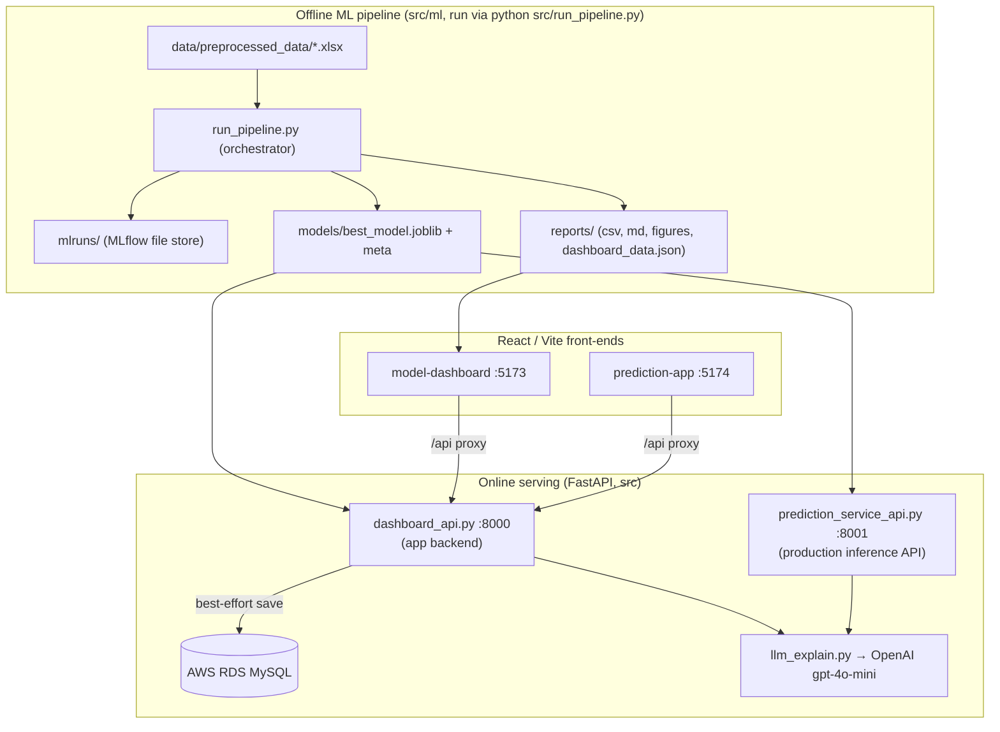
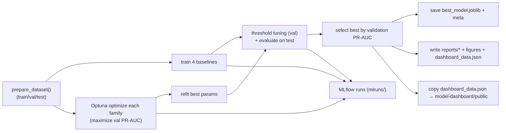
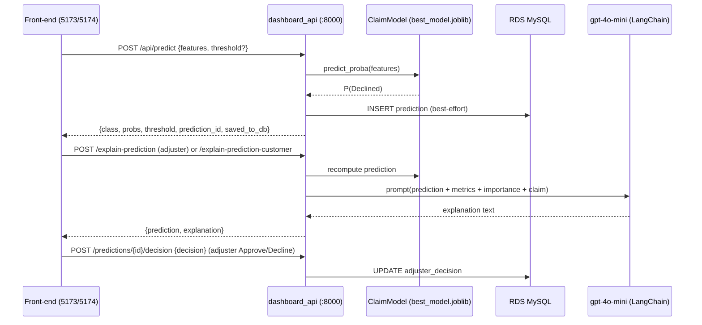

# DESIGN — Claim Approval ML System

This document explains the architecture and design of this repository for developers who need to
get productive quickly. It is based only on what exists in the repo at the time of writing; anything
uncertain is called out in **§12 Known Limitations / Open Questions**.

---

## 1. Project Overview

**Purpose.** Predict an insurance device-claim's `status` — **`Declined`** (the positive class, encoded
`1`) vs **`Completed`** (`0`) — and make the whole modeling process **explainable**. The dataset is
imbalanced (~16% Declined), so the system optimizes and selects models on **PR-AUC**, not accuracy.

The repository is more than a model; it is an end-to-end, explainable system with four parts:

1. **An offline ML pipeline** that trains, Optuna-optimizes, evaluates, and selects the best of four
   model families (Random Forest, XGBoost, LightGBM, CatBoost), tracking everything in MLflow.
2. **Two FastAPI backends** — a UI-facing application backend and a production inference API.
3. **Two independent React/Vite front-ends** — an analytics dashboard and an operational
   prediction-&-review app.
4. **Integrations** — LangChain + OpenAI `gpt-4o-mini` for natural-language explanations, and AWS RDS
   (MySQL) for persisting predictions, explanations, and adjuster decisions.

Core convention (do not break): rank/select on **validation PR-AUC**; stratified **70/15/15** split;
preprocessing fit on **train only**; the **test set is used once**; seed **42** everywhere.

---

## 2. Repository Structure

```
bolttech-prac/
├── data/
│   ├── original_data/                         # raw inputs (not all tracked)
│   └── preprocessed_data/                      # claim_approval_feature_dataset_v2.xlsx + EDA reports
├── src/                                        # Python backend (run with `--app-dir src`)
│   ├── config.py                               # shared config, paths, seed, class convention, .env loader
│   ├── model_factory.py                        # compat shim → ml.model_factory (pickle anchor)
│   ├── run_pipeline.py                         # compat entry point → ml.run_pipeline
│   ├── ml/                                     # offline ML library (training/optimization/evaluation)
│   │   ├── model_factory.py                    # build/fit 4 families + ClaimModel (the saved-model class)
│   │   ├── run_pipeline.py                      # ORCHESTRATOR — trains, selects, writes all artifacts
│   │   ├── data.py                             # load/validate/encode/stratified-split
│   │   ├── preprocessing.py                    # tree pipeline (impute+one-hot) / CatBoost native cats
│   │   ├── train_baselines.py                  # baseline configs per family
│   │   ├── optimize_optuna.py                  # Optuna studies (maximize val PR-AUC) + nested MLflow
│   │   ├── evaluate.py                         # metrics + plots
│   │   ├── threshold_tuning.py                 # 0.05–0.95 sweep, pick best F1(Declined)
│   │   ├── explainability.py                   # feature-importance grouping
│   │   └── mlflow_tracking.py                  # MLflow helpers
│   ├── dashboard_api.py                        # FastAPI app backend (uvicorn dashboard_api:app, :8000)
│   ├── prediction_service_api.py               # FastAPI production API (uvicorn …:app, :8001)
│   ├── db.py                                   # AWS RDS (MySQL) persistence (SQLAlchemy + PyMySQL)
│   ├── llm_explain.py                          # LangChain + gpt-4o-mini explanations
│   ├── prompts/                                # prompt templates per audience (model/adjuster/customer)
│   ├── load_dataset_to_db.py                   # load the dataset into a SQL table
│   ├── eda_report.py                           # standalone: generate the EDA markdown report
│   └── fill_unknown.py                         # standalone one-off: fill missing categoricals
├── model-dashboard/                            # Front-end app #1 (Vite + React + Recharts, :5173)
├── prediction-app/                             # Front-end app #2 (Vite + React, :5174)
├── models/                                     # best_model.joblib + best_model_meta.json (generated)
├── reports/                                    # comparison.csv, threshold_analysis.csv, report.md,
│                                               #   dashboard_data.json, figures/ (generated)
├── mlruns/                                     # MLflow file store (generated, git-ignored)
├── docs/                                       # mlflow / optuna / *_importance explainers
├── notebooks/                                  # preprocessing.ipynb, model_experiment_summary.ipynb
├── Dockerfile, .dockerignore                   # multi-stage build for the serving API
├── pyproject.toml, uv.lock                     # Python deps (managed with uv)
├── .env / .env.example                         # secrets (git-ignored) + template
└── README.md, CLAUDE.md, DESIGN.md
```

Generated directories (`models/`, `reports/`, `mlruns/`, and the apps' `node_modules/`/`dist/`) are
produced by running the pipeline / installing front-ends; `mlruns/`, `node_modules/`, `dist/`, and
`.env` are git-ignored.

---

## 3. High-Level Architecture

The system has a clear **offline / online** split, joined by two shared artifacts: the trained model
(`models/best_model.joblib`) and the dashboard bundle (`reports/dashboard_data.json`).



**Boundaries.**
- Front-ends never run the model; they call FastAPI over HTTP (the Vite dev server proxies `/api` →
  `:8000`). The model and any secrets stay server-side.
- The dashboard's static pages read `dashboard_data.json` (copied into `model-dashboard/public/` by the
  pipeline) and work without the backend; only live prediction needs it.

---

## 4. Core Components

| Component | File(s) | Responsibility |
|---|---|---|
| **Shared config** | `src/config.py` | Paths, seed, class convention (`Declined`=1), split sizes, `N_TRIALS`, MLflow experiment name; loads `.env`. Imported almost everywhere. |
| **Model factory + `ClaimModel`** | `src/ml/model_factory.py` (+ top-level shim) | Builds/fits the 4 families; `ClaimModel` wraps preprocessor + estimator + threshold behind one `predict_proba`/`predict`/`feature_importance` API. **`ClaimModel` is the class pickled into `best_model.joblib`.** |
| **Pipeline orchestrator** | `src/ml/run_pipeline.py` (+ shim) | Runs the whole offline flow and writes every artifact. |
| **ML library** | `src/ml/{data,preprocessing,train_baselines,optimize_optuna,evaluate,threshold_tuning,explainability,mlflow_tracking}.py` | The individual training/evaluation steps. |
| **App backend** | `src/dashboard_api.py` (`:8000`) | UI-facing API: predictions, model/dashboard data, prediction history, LLM explanations, adjuster decisions; persists to RDS. Consumed by both front-ends. |
| **Production API** | `src/prediction_service_api.py` (`:8001`) | Ops-grade inference: `/health`, `/ready`, `/metadata`, `/predict`, `/predict-batch`, `/metrics`; Pydantic schemas, validation, structured errors, latency/error metrics. |
| **Persistence** | `src/db.py` | SQLAlchemy + PyMySQL access to RDS; auto-creates/migrates the `claim_predictions` table; best-effort saves. |
| **LLM explanations** | `src/llm_explain.py`, `src/prompts/` | LangChain `ChatOpenAI(gpt-4o-mini)` turning model/prediction/feature data into prose for three audiences. |
| **Front-ends** | `model-dashboard/`, `prediction-app/` | Analytics dashboard (7 pages) and operational prediction/review app (5 tabs). |
| **Utilities** | `src/load_dataset_to_db.py`, `src/eda_report.py`, `src/fill_unknown.py` | Load dataset → SQL table; generate EDA report; one-off categorical fill. |

---

## 5. Module Responsibilities

**Offline ML library (`src/ml/`)**
- `data.py` — `prepare_dataset()`: read xlsx, validate, drop `other`/`issueDesc`, infer numeric vs
  categorical, encode target (`Completed`→0, `Declined`→1), stratified 70/15/15 split.
- `preprocessing.py` — `ColumnTransformer` (median impute + one-hot) for RF/XGB/LGBM; native string
  categoricals for CatBoost. Fit on the train split only.
- `model_factory.py` — `fit_model(model_type, params, imbalance, ds)` returns a fitted `ClaimModel`;
  per-family estimator builders apply the imbalance strategy (`class_weight`, `scale_pos_weight=5.36`,
  CatBoost class weights), early stopping for boosters.
- `train_baselines.py` — fixed baseline hyperparameters per family.
- `optimize_optuna.py` — per-family `optimize_model()` (TPE sampler, seed 42) maximizing **validation
  PR-AUC**; logs nested MLflow runs.
- `evaluate.py` — `compute_metrics()` + confusion/PR/ROC/importance plots.
- `threshold_tuning.py` — sweep 0.05–0.95, pick best F1 for Declined.
- `explainability.py` — roll one-hot importances back to original feature names.
- `mlflow_tracking.py` — point MLflow at the local `./mlruns` file store + logging helpers.
- `run_pipeline.py` — the orchestrator (see §6).

**Serving layer (top-level `src/`)**
- `dashboard_api.py`, `prediction_service_api.py`, `db.py`, `llm_explain.py`, `prompts/` — see §4 and §6.

**Shared/compat**
- `config.py` and `model_factory.py` sit at the top level because both the offline pipeline and the
  online serving layer depend on them (and `model_factory` is the pickle anchor). `model_factory.py`
  and `run_pipeline.py` at the top level are thin **compatibility shims** re-exporting `ml.model_factory`
  / `ml.run_pipeline` (see §9).

---

## 6. Data Flow / Request Flow

### 6.1 Offline training/selection (`python src/run_pipeline.py`)



The orchestrator builds a comparison of all 8 models (4 families × baseline/optimized), selects the
best by validation PR-AUC, and persists the model, a metadata JSON, CSV/MD reports, figures, the
`dashboard_data.json` bundle, and MLflow runs.

### 6.2 Online prediction + explanation (front-end → backend)



Key rule reflected in code: **the ML model makes the decision; the LLM only explains it.** The
`/explain-prediction*` endpoints recompute the model output server-side so the explanation always
matches the real prediction, and the adjuster's Approve/Decline is stored in a **separate**
`adjuster_decision` column (the model's `predicted_class` is preserved).

### 6.3 Persistence schema (`claim_predictions`, auto-created)
One row per `/predict`: `id`, `created_at`, **one column per model feature** (numeric `DOUBLE`,
categorical `VARCHAR`), the prediction columns (`predicted_class`, `predicted_label`,
`probability_*`, `threshold_used`, `model_version`), and the later-added `adjuster_explanation`,
`customer_explanation`, `adjuster_decision` (added via an `information_schema` migration in `db.py`).
A separate `claim_dataset_v2` table is produced by `load_dataset_to_db.py`.

---

## 7. Configuration and Environment

- **`src/config.py`** is the single source of truth: repo paths (`ROOT`, model/report paths), target
  and class convention, `EXCLUDE_COLS = ["other","issueDesc"]`, `IMBALANCE_WEIGHT = 5.36`,
  `RANDOM_STATE = 42`, `TEST_SIZE/VAL_SIZE = 0.15`, threshold range, `N_TRIALS` (default **50**,
  env-overridable), `MLFLOW_EXPERIMENT`, and `ALL_MODELS`. It loads `.env` via `python-dotenv` on
  import (`override=False`).
- **Environment variables** (from `.env`, see `.env.example`):
  - `OPENAI_API_KEY` — required only for the `/explain*` LLM endpoints (else they return `503`).
  - `DB_HOST` / `DB_PORT` / `DB_NAME` / `DB_USER` / `DB_PASSWORD` — RDS MySQL; if unset, persistence is
    silently skipped and `/predict` still works.
  - `N_TRIALS` — Optuna trials per family.
  - `MLFLOW_ALLOW_FILE_STORE=true` — set automatically by `mlflow_tracking` for the local file store.
  - `VITE_API_BASE` (front-end build) and `API_TARGET` (prediction-app dev proxy target).
- **Ports:** `8000` dashboard_api · `8001` prediction_service_api · `5173` model-dashboard ·
  `5174` prediction-app · `5000` (suggested) MLflow UI.

Secrets live only in `.env` (git-ignored, and excluded from the Docker build context). They are read
from the process environment at runtime.

---

## 8. External Dependencies and Integrations

Python deps (`pyproject.toml`, `requires-python >=3.11`, locked in `uv.lock`):
`pandas`, `numpy`, `scipy`, `scikit-learn`, `openpyxl`, `joblib`; gradient boosting `xgboost`,
`lightgbm`, `catboost`; `optuna`, `mlflow`; `matplotlib`; serving `fastapi`, `uvicorn[standard]`,
`pydantic`; persistence `sqlalchemy`, `pymysql`; LLM `langchain-openai`; config `python-dotenv`.

Front-ends: `react`, `react-dom`, `vite`, `@vitejs/plugin-react` (model-dashboard also uses
`recharts`; prediction-app draws charts with plain CSS).

Integrations:
- **OpenAI `gpt-4o-mini`** via LangChain (`ChatOpenAI`), server-side only.
- **AWS RDS (MySQL)** via SQLAlchemy + PyMySQL.
- **MLflow** local file store at `./mlruns` (no DB/registry server; the best model is also written to
  `models/`).
- **LightGBM/XGBoost** require the OS OpenMP runtime (`libgomp1`), installed in the Docker image.

---

## 9. Design Patterns and Conventions

- **`ClaimModel` wrapper (uniform model interface).** Bundles the fitted preprocessor (if any) +
  estimator + tuned threshold, exposing one `predict_proba`/`predict`/`feature_importance` API across
  all four families. It is the single object pickled and served, so train-time and serve-time behavior
  are identical.
- **PR-AUC-first selection + decoupled threshold.** Models are ranked by threshold-independent
  validation PR-AUC; the operating threshold is tuned separately (max F1 for Declined) per model.
- **Compatibility shims for moved/renamed code.** `src/model_factory.py` and `src/run_pipeline.py`
  re-export from `src/ml/` so the pickled artifact (`model_factory.ClaimModel`) still unpickles and the
  documented `python src/run_pipeline.py` command still works after the code moved into `ml/`.
- **Top-level shared contract vs. library.** `config.py` + `model_factory.py` are the shared
  contract between the offline `ml/` library and the online serving layer; everything else is grouped
  by concern.
- **Prompt templates as data.** `src/prompts/` isolates LLM prompts (model / adjuster / customer) from
  generation logic for easy review/versioning.
- **Best-effort side effects.** DB persistence never breaks `/predict`; the response reports
  `saved_to_db`. Missing `OPENAI_API_KEY`/DB degrade gracefully (clear `503`/notices).
- **Model decides, LLM explains.** Strict separation enforced in prompts and endpoints; the adjuster's
  human decision is stored separately from the model output.
- **Front-end decoupling.** Apps consume a static JSON bundle + a stable HTTP contract via a `/api`
  proxy; they hold no model logic or secrets.
- **Reproducibility.** Seed 42, `TPESampler(seed=42)`, `n_jobs=1` for the study; deterministic splits.

---

## 10. Build, Test, and Deployment Flow

**Python (uv).**
```bash
sudo apt-get install -y libgomp1          # OpenMP runtime for LightGBM/XGBoost
uv sync                                    # create .venv from uv.lock
python src/run_pipeline.py                 # train/optimize/select; writes all artifacts
uvicorn dashboard_api:app --app-dir src --port 8000
uvicorn prediction_service_api:app --app-dir src --port 8001
mlflow ui --backend-store-uri ./mlruns --port 5000
```

**Front-ends (Node 18+).**
```bash
cd model-dashboard && npm install && npm run dev   # :5173
cd prediction-app  && npm install && npm run dev   # :5174
# build: npm run build  (outputs dist/)
```

**Docker (serving API).** Multi-stage `Dockerfile`: builder uses the `astral-sh/uv` image to
`uv sync --frozen --no-install-project --no-dev` (deps cached on `pyproject.toml`+`uv.lock`); runtime is
`python:3.12-slim-bookworm` with `libgomp1`, the copied `.venv`, and `COPY src/ models/ reports/ data/`.
Runs as non-root, `EXPOSE 8000`, `HEALTHCHECK` on `/health`, default
`CMD uvicorn prediction_service_api:app`. The dependency layer is cached *before* the source `COPY`, so
updated source always produces fresh layers (no stale-content risk).

**Tests.** There is **no automated test suite or CI** in the repo. Validation today is manual:
`npm run build` for the front-ends, importing/starting the backends, and `python src/run_pipeline.py`.

---

## 11. Extension Points

- **Add a model family** — extend `ALL_MODELS` (config), add a builder + fit branch in
  `ml/model_factory.py`, a baseline in `ml/train_baselines.py`, and a search space in
  `ml/optimize_optuna.suggest_params`.
- **Add an explanation audience** — add a prompt module under `src/prompts/`, a `generate_*` function
  in `llm_explain.py`, and an endpoint in `dashboard_api.py` (and/or `prediction_service_api.py`).
- **Add/clarify API endpoints** — both FastAPI apps are plain route modules; add routes and (for the
  production API) Pydantic schemas.
- **Evolve the DB schema** — add columns via the `information_schema` migration pattern in `db.py`
  (`_ensure_extra_columns`), keeping inserts backward-compatible.
- **Swap persistence** — `db.py` is isolated behind `db_enabled()` / `save_prediction()` /
  `save_explanation()` / `save_decision()`; another backend can replace it without touching endpoints.
- **Front-end pages/tabs** — add a page/tab + an `api/` client call; data comes from `dashboard_data.json`
  or the HTTP API.

---

## 12. Known Limitations / Open Questions

- **No automated tests / CI.** Behavior is verified manually. A regression suite (pipeline smoke,
  endpoint contract, pickle-load) would reduce risk.
- **Moderate model signal.** On this dataset the selected model's test PR-AUC is ~0.30 (vs a ~0.16 base
  rate) with low precision for Declined; predictions are decision-support, not autonomous decisions.
- **Two serving apps share some logic.** `dashboard_api.py` and `prediction_service_api.py` both build
  model-info dicts and call `llm_explain`; this duplication is intentional (different response shapes)
  but could be factored if it grows.
- **Docker `HEALTHCHECK` assumes the default CMD.** It probes `/health`, which exists on
  `prediction_service_api`; overriding CMD to `dashboard_api:app` (no `/health`) would report unhealthy.
- **RDS connection is not TLS-enforced** in code (works against the current instance without SSL); add
  the RDS CA bundle if encrypted connections are required.
- **Committed model is a snapshot.** `models/best_model.joblib` + `dashboard_data.json` reflect a
  specific run; retraining with a different `N_TRIALS` changes the headline numbers.
- **Dev vs image Python.** Developed/validated on Python 3.14 locally; the Docker image pins 3.12
  (both satisfy `requires-python >=3.11` and the `uv.lock` resolution).
- **Open question — original raw data.** `data/original_data/` is referenced by
  `notebooks/preprocessing.ipynb`, but the raw source file is not fully tracked in git; reproducing the
  preprocessing from scratch requires obtaining that file.
- **Open question — production front-end serving.** The `/api` proxy is a Vite *dev* feature; a
  production static deployment needs `VITE_API_BASE` baked at build time or a reverse proxy. No
  production web-server/compose config is included.
